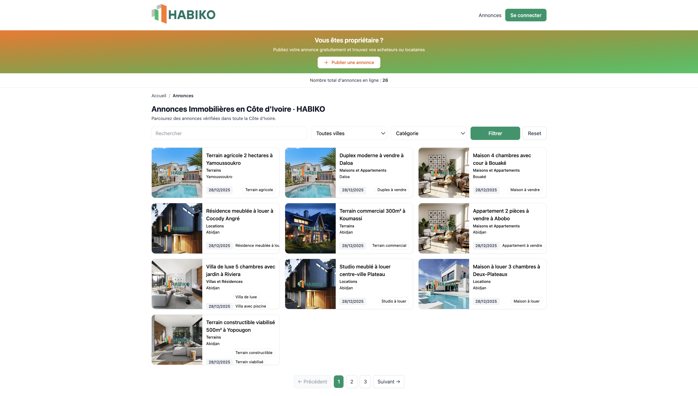
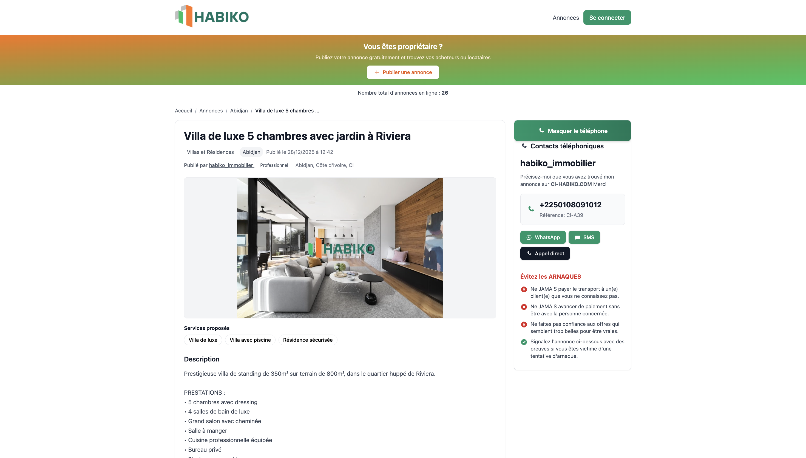
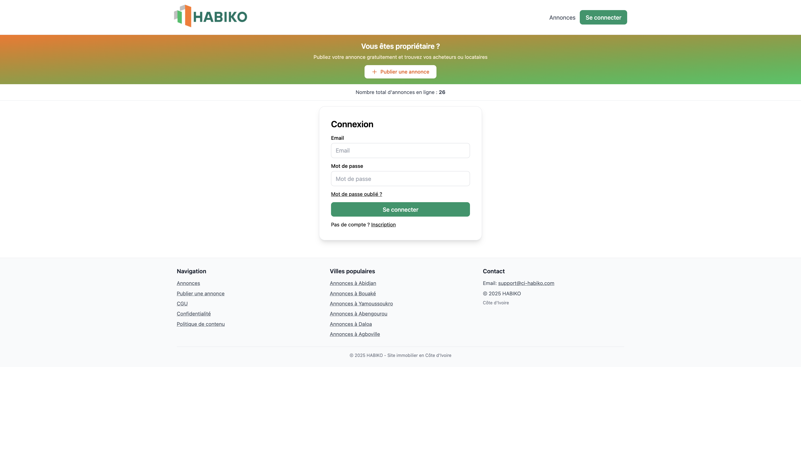
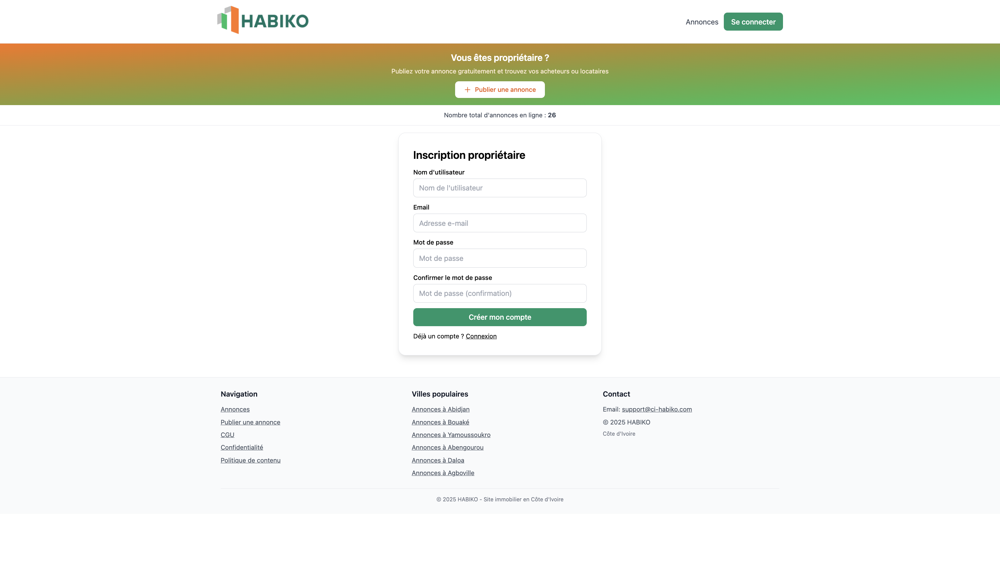
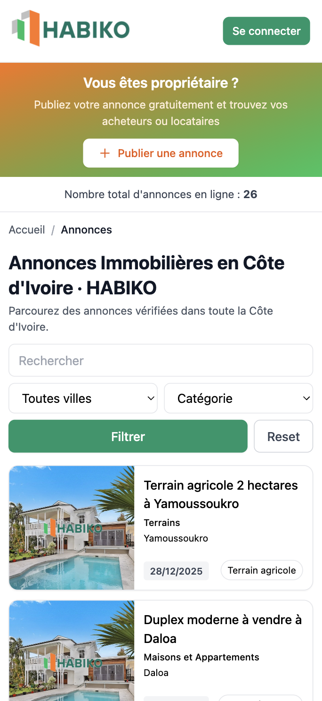

# 🏠 HABIKO - Plateforme Immobilière Côte d'Ivoire

Plateforme web de petites annonces immobilières pour la Côte d'Ivoire, développée avec Django/Python. Permet aux propriétaires de publier leurs annonces (maisons, villas, terrains, locations) et aux acheteurs/locataires de trouver facilement ce qu'ils cherchent.

**Développé par** [Diarrassouba Issiaka Konateh](https://www.linkedin.com/in/diarrassouba-issiaka-b263062ba?utm_source=share&utm_campaign=share_via&utm_content=profile&utm_medium=ios_app)

## ✨ Fonctionnalités principales

- 🏘️ **Publication d'annonces** : Maisons, villas, terrains, locations avec champs dynamiques selon la catégorie
- 🔍 **Recherche avancée** : Filtrage par ville, catégorie et sous-catégories
- 💳 **Système de paiement** : Intégration CinetPay pour les services premium
- 👤 **Gestion des profils** : Système d'authentification avec vérification email
- 📱 **Design responsive** : Interface adaptée mobile et desktop
- 🎨 **Interface moderne** : Design avec Tailwind CSS et couleurs orange/vert

## 🛠 Stack technique

- **Backend** : Django 5.1.2, Python 3.12+
- **Base de données** : PostgreSQL (production) / SQLite (développement)
- **Frontend** : Django Templates + Tailwind CSS, HTMX
- **Auth** : django-allauth
- **Cache & Tasks** : Redis + Celery
- **Storage** : django-storages (S3 compatible) ou FileSystemStorage
- **SEO** : django-sitemaps, robots.txt, meta tags dynamiques
- **Images** : Pillow pour le traitement d'images

## 📸 Captures d'écran

### Page d'accueil - Liste des annonces



Page principale affichant toutes les annonces immobilières disponibles avec filtres par ville et catégorie.

### Page de détail d'annonce



Page détaillée d'une annonce avec toutes les informations, photos, coordonnées du propriétaire et boutons de contact.

### Page de connexion



Interface de connexion pour les utilisateurs avec possibilité de récupération de mot de passe.

### Page d'inscription



Formulaire d'inscription pour créer un compte et commencer à publier des annonces.

### Version mobile - Liste des annonces



Interface responsive optimisée pour les appareils mobiles, facilitant la navigation sur smartphone.

### Version mobile - Détail d'annonce


Affichage adapté des détails d'annonce sur mobile avec toutes les informations essentielles.

### Version mobile - Connexion


Page de connexion optimisée pour mobile avec formulaire adapté aux petits écrans.

### Version mobile - Inscription


Formulaire d'inscription responsive pour une expérience utilisateur optimale sur mobile.

## 🚀 Installation rapide

### Prérequis

- Python 3.12+
- PostgreSQL 15+ (ou SQLite pour le développement)
- Redis 7+ (pour Celery)
- pip et virtualenv

### 1. Cloner le repository

```bash
git clone https://github.com/votre-username/habiko.git
cd habiko
```

### 2. Créer l'environnement virtuel

```bash
python3 -m venv .venv
source .venv/bin/activate  # Linux/Mac
# ou .venv\Scripts\activate  # Windows
```

### 3. Installer les dépendances

```bash
pip install -r requirements.txt
```

### 4. Configuration environnement

```bash
cp .env.example .env
# Éditer .env avec vos paramètres
```

### 5. Base de données

```bash
# Pour SQLite (développement)
python manage.py migrate

# Pour PostgreSQL (production)
# Créer la base de données d'abord
createdb habiko
python manage.py migrate

# Créer un superutilisateur
python manage.py createsuperuser
```

### 6. Lancer l'application

```bash
# Terminal 1 - Serveur web
python manage.py runserver

# Terminal 2 - Celery worker (optionnel)
celery -A kiaba worker -l info

# Terminal 3 - Celery beat (optionnel)
celery -A kiaba beat -l info
```

L'application sera accessible sur `http://localhost:8000`

## 📁 Structure du projet

```
HABIKO/
├── accounts/          # Gestion des utilisateurs et profils
├── ads/               # Modèles et vues pour les annonces
├── core/              # Vues principales, middleware
├── seo/               # Sitemaps et robots.txt
├── templates/         # Templates Django
├── static/            # Fichiers statiques (CSS, JS, images)
├── media/             # Médias uploadés par les utilisateurs
├── kiaba/             # Configuration Django (settings, urls)
├── .env.example       # Exemple de variables d'environnement
└── requirements.txt   # Dépendances Python
```

## 🎯 Catégories d'annonces

### Maisons et Appartements
- Maison à vendre
- Appartement à vendre
- Studio à vendre
- Duplex à vendre
- Villa à vendre
- Maison meublée à vendre
- Appartement meublé à vendre

### Villas et Résidences
- Villa de luxe
- Résidence meublée
- Résidence de standing
- Villa avec piscine
- Résidence sécurisée

### Terrains
- Terrain à vendre
- Terrain constructible
- Terrain viabilisé
- Parcelle à vendre
- Terrain commercial

### Locations
- Maison à louer
- Appartement à louer
- Studio à louer
- Villa à louer
- Résidence meublée à louer

## 🔧 Champs dynamiques par catégorie

Le formulaire de publication s'adapte automatiquement selon la catégorie sélectionnée :

- **Villas et Résidences** : Prix jours ouvrables, prix jours non ouvrables, surface, nombre de chambres
- **Maisons et Appartements** : Prix de vente, surface, nombre de chambres, nombre de salles de bain
- **Terrains** : Prix, surface
- **Locations** : Loyer mensuel, charges, caution, surface, nombre de chambres

## 🧪 Tests

```bash
# Tests unitaires
python manage.py test

# Avec coverage
coverage run --source='.' manage.py test
coverage report
```

## 🔒 Sécurité

- Protection CSRF
- Protection XSS (sanitisation avec bleach)
- Validation stricte des uploads (max 5 photos par annonce)
- Rate limiting avec Redis
- Middleware de sécurité personnalisé

## 🌍 SEO

- Sitemap XML automatique (`/sitemap.xml`)
- Robots.txt optimisé (`/robots.txt`)
- Meta tags dynamiques pour chaque page
- URLs propres avec slugs
- Structure optimisée pour le référencement local

## 🚀 Déploiement

### Variables d'environnement importantes

```bash
DEBUG=False
SECRET_KEY=your-secret-key
ALLOWED_HOSTS=ci-habiko.com,www.ci-habiko.com
DB_ENGINE=postgresql
POSTGRES_DB=habiko
POSTGRES_USER=habiko
POSTGRES_PASSWORD=secure-password
REDIS_URL=redis://localhost:6379/1
```

### Checklist déploiement

- [ ] Base de données PostgreSQL créée
- [ ] Redis démarré
- [ ] Variables d'environnement configurées
- [ ] Migrations appliquées
- [ ] Fichiers statiques collectés (`python manage.py collectstatic`)
- [ ] Celery worker/beat démarrés
- [ ] Certificat SSL configuré
- [ ] Domaines configurés dans ALLOWED_HOSTS

## 📞 Support

Pour toute question ou contribution :

- Ouvrir une issue sur GitHub
- Proposer une Pull Request

## 👨‍💻 Développeur

Ce projet a été développé par **Diarrassouba Issiaka Konateh**.

📧 Contact : [LinkedIn](https://www.linkedin.com/in/diarrassouba-issiaka-b263062ba?utm_source=share&utm_campaign=share_via&utm_content=profile&utm_medium=ios_app)

## 📄 Licence

Ce projet est open source et disponible sous licence MIT.

---

**HABIKO** - Plateforme Immobilière Côte d'Ivoire © 2024

Développé par [Diarrassouba Issiaka Konateh](https://www.linkedin.com/in/diarrassouba-issiaka-b263062ba?utm_source=share&utm_campaign=share_via&utm_content=profile&utm_medium=ios_app)
